# SBBL Methodology

## 🎯 Overview

**SBBL** is an AI-accelerated software development methodology designed to eliminate procrastination and "overthinking" in the product development process.

### Acronym

SBBL stands for 4 core phases:

- **S**park (Ignite the Idea)
- **B**lueprint (Design the Plan)
- **B**uild (Create the Product)
- **L**aunch (Release & Optimize)

### 🔄 The SBBL Cycle

```mermaid
graph TD
    %% Styles
    classDef human fill:#e3f2fd,stroke:#1565c0,stroke-width:2px,color:#000;
    classDef ai fill:#e8f5e9,stroke:#2e7d32,stroke-width:2px,color:#000;
    classDef market fill:#fff3e0,stroke:#ef6c00,stroke-width:2px,color:#000;

    %% Nodes
    S(🔥 Spark<br/><i>Idea & Vision</i>):::human
    BP(📐 Blueprint<br/><i>Specs & Context</i>):::human
    B(🔨 Build<br/><i>AI Coding & Testing</i>):::ai
    L(🚀 Launch<br/><i>Deploy & Feedback</i>):::market

    %% Flows
    S ==>|1. Define| BP
    BP ==>|2. Prompting| B
    B ==>|3. Deploy| L
    
    %% Feedback Loops
    B -.->|Fix Bugs / Refine Context| BP
    L -.->|User Feedback| S

    %% Legend
    subgraph Legend [Legend]
        H[Human Task]:::human
        A[AI Task]:::ai
        M[Market Feedback]:::market
    end
```



## 🎪 Core Purpose

To standardize the creation of high-quality Context documents to:
- Feed into AI models (LLMs)
- Achieve Zero-shot accuracy in code generation
- Minimize debugging and refactoring loops

## 🌟 SBBL: Agile for the AI Era

### The Evolution of Software Development

```
Traditional Agile (2001)      SBBL Phase 1 (2025)          SBBL Phase 2 (Future)
Human ↔ Human                 Human ↔ AI                   AI ↔ AI
Sprint Planning               Blueprint Creation           Automated Planning
Daily Standups                AI Implementation            Self-Monitoring
Code Reviews                  Human Evaluation             AI Quality Assurance
Retrospectives                Iterate & Learn              Self-Optimization
```

### Vision

**SBBL is not just a tool - it's a framework for collaboration in the AI era:**

#### Phase 1: Human-AI Collaboration (Current)
- **Human**: Defines vision, architecture, business rules (Blueprint)
- **AI**: Implements features, writes code, generates tests
- **Human**: Reviews, evaluates, provides feedback
- **Result**: 10x faster development with human oversight

#### Phase 2: AI-AI Collaboration (Future)
- **AI Agent 1 (Architect)**: Creates and refines blueprints
- **AI Agent 2 (Developer)**: Implements based on blueprint
- **AI Agent 3 (QA)**: Tests and validates implementation
- **AI Agent 4 (Monitor)**: Tracks metrics, suggests improvements
- **Human**: Strategic direction only
- **Result**: Fully autonomous development pipeline

### Why SBBL is "Agile for AI"

| Traditional Agile | SBBL |
|-------------------|------|
| User Stories | Blueprint Sections |
| Sprint Planning | Roadmap Definition |
| Daily Standups | AI Progress Tracking |
| Code Reviews | Automated Evaluation |
| Retrospectives | Metrics Dashboard |
| Team Velocity | AI Accuracy Score |

**Key Difference**: SBBL standardizes the "language" between humans and AI (and eventually AI-AI), just as Agile standardized collaboration between humans.

---

## 📋 4 Detailed Phases

### 1️⃣ Spark (Ignite the Idea)

**Goal**: Transform vague ideas into clear descriptions

**Input**:
- Product idea (1-2 sentences)
- Problem to solve
- Target audience

**Output**:
- Product Vision Statement
- Target Audience Definition
- Core Value Proposition

**Key Questions**:
- What problem does your product solve?
- Who is the primary user?
- Why do they need this product?

### 2️⃣ Blueprint (Design the Plan)

**Goal**: Create detailed technical documentation before coding

**Input**:
- Output from Spark phase
- Tech Stack preferences
- Business constraints

**Output**: `BLUEPRINT.md` or `CONTEXT.md` file containing:

#### 2.1 Project Meta
```markdown
- Project Name
- Vision (1-2 paragraphs)
- Target Audience
- Success Metrics
```

#### 2.2 Tech Stack
```markdown
- Frontend: (e.g., Next.js, React, Vue)
- Backend: (e.g., Node.js, Go, Python)
- Database: (e.g., PostgreSQL, MongoDB, Supabase)
- Deployment: (e.g., Vercel, AWS, Railway)
- AI/ML: (e.g., OpenAI, Gemini, Claude)
```

#### 2.3 Architecture
```markdown
- System Architecture Diagram
- Data Flow: Client -> API -> Database
- Authentication Flow
- Key Integrations
```

#### 2.4 Database Schema
```sql
-- Example: User Table
CREATE TABLE users (
  id UUID PRIMARY KEY,
  email VARCHAR(255) UNIQUE NOT NULL,
  created_at TIMESTAMP DEFAULT NOW()
);

-- Relationships
-- users 1:N projects
```

#### 2.5 Implementation Roadmap
```markdown
Week 1: Setup & Authentication
- [ ] Initialize project
- [ ] Setup database
- [ ] Implement auth

Week 2: Core Features
- [ ] Feature A
- [ ] Feature B

Week 3: Polish & Deploy
- [ ] Testing
- [ ] Deployment
```

#### 2.6 Business Rules
```markdown
- Free users: Max 1 project
- Pro users: Unlimited projects
- Session timeout: 30 minutes
- Max file upload: 10MB
```

### 3️⃣ Build (Create the Product)

**Goal**: Use AI to code based on the Blueprint

**Process**:
1. Prepare System Prompt for AI
2. Feed BLUEPRINT.md into context
3. Request AI to implement each feature
4. Review & iterate

**Best Practices**:
- Break features into specific tasks
- Test after each feature
- Commit code frequently
- Use AI to generate tests

### 4️⃣ Launch (Release & Optimize)

**Goal**: Deploy and collect feedback

**Checklist**:
- [ ] Performance testing
- [ ] Security audit
- [ ] SEO optimization
- [ ] Analytics setup
- [ ] User feedback mechanism
- [ ] Monitoring & logging

## 🎯 Target Audience

### Primary User: AI Orchestrator
Responsible for bridging business ideas with AI execution capabilities.

**Required Skills**:
- Basic understanding of tech stack
- Ability to describe requirements clearly
- Systems thinking

### Secondary User: Solo Developers / Indie Hackers
Those who want to build products quickly from A-Z.

## 🔑 Golden Principles

1. **Document First, Code Later**: Never code before having a Blueprint
2. **Context is King**: The more detailed the Blueprint, the more accurate the AI code
3. **Iterate Fast**: Use AI for rapid prototyping, fail fast
4. **Measure Everything**: Track metrics from day one

## 📊 Success Metrics

- **Time to First Deploy**: How long from idea to MVP deploy?
- **AI Accuracy Rate**: % of code generated correctly by AI on the first try
- **Iteration Cycles**: Number of fixes/refactors needed
- **User Feedback Score**: Rating from real users

## 🛠️ Tools Ecosystem

### CLI Tool: `sbbl-cli`
- Interactive wizard to create Blueprints
- Template management
- AI prompt generation

### Web Application: `sbbl-app`
- Visual Blueprint builder
- Collaboration features
- Version control for documents
- AI integration dashboard

## 📚 References

- [CLI Tool Specification](./cli-specification.md)
- [Web App Specification](./web-app-specification.md)
- [Blueprint Templates](./templates.md)
- [Best Practices](./best-practices.md)

---

**Version**: 1.0.0  
**Last Updated**: 2025-11-29  
**Maintainer**: DiogenesAI Team