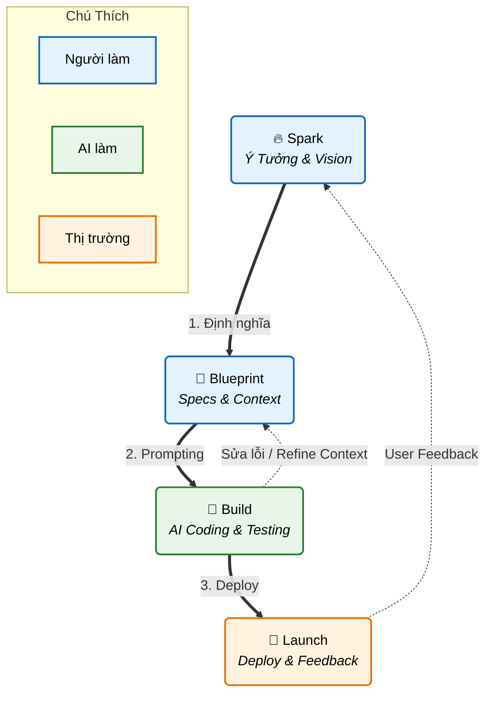

# Phương Pháp Luận SBBL

## 🎯 Tổng Quan

**SBBL** là phương pháp luận phát triển phần mềm tăng tốc bởi AI, giúp loại bỏ sự trì hoãn và "overthinking" trong quá trình phát triển sản phẩm.

### Viết Tắt

SBBL đại diện cho 4 giai đoạn cốt lõi:

- **S**park (Thắp lửa ý tưởng)
- **B**lueprint (Dựng bản thiết kế)
- **B**uild (Kiến tạo sản phẩm)
- **L**aunch (Ra mắt & Tối ưu)

### 🔄 Quy Trình SBBL (The SBBL Cycle)



## 🎪 Mục Đích Cốt Lõi

Chuẩn hóa việc tạo ra các tài liệu ngữ cảnh (Context) chất lượng cao để:
- Nạp vào các mô hình AI (LLMs)
- Giúp AI code đúng ngay từ lần đầu tiên (Zero-shot accuracy)
- Giảm thiểu vòng lặp sửa lỗi và refactoring

## 🌟 SBBL: Agile Cho Kỷ Nguyên AI

### Sự Tiến Hóa Của Phát Triển Phần Mềm

```
Agile Truyền Thống (2001)     SBBL Giai Đoạn 1 (2025)      SBBL Giai Đoạn 2 (Tương Lai)
Người ↔ Người                 Người ↔ AI                   AI ↔ AI
Sprint Planning               Tạo Blueprint                Lập Kế Hoạch Tự Động
Daily Standups                AI Implementation            Tự Giám Sát
Code Reviews                  Đánh Giá Của Người           AI Quality Assurance
Retrospectives                Lặp Lại & Học Hỏi            Tự Tối Ưu
```

### Tầm Nhìn

**SBBL không chỉ là công cụ - đó là framework cho collaboration trong kỷ nguyên AI:**

#### Giai Đoạn 1: Human-AI Collaboration (Hiện Tại)
- **Người**: Định nghĩa vision, kiến trúc, business rules (Blueprint)
- **AI**: Implement features, viết code, generate tests
- **Người**: Review, đánh giá, cung cấp feedback
- **Kết quả**: Phát triển nhanh hơn 10x với sự giám sát của con người

#### Giai Đoạn 2: AI-AI Collaboration (Tương Lai)
- **AI Agent 1 (Architect)**: Tạo và tinh chỉnh blueprints
- **AI Agent 2 (Developer)**: Implement dựa trên blueprint
- **AI Agent 3 (QA)**: Test và validate implementation
- **AI Agent 4 (Monitor)**: Theo dõi metrics, đề xuất cải tiến
- **Người**: Chỉ đạo chiến lược
- **Kết quả**: Pipeline phát triển hoàn toàn tự động

### Tại Sao SBBL Là "Agile Cho AI"

| Agile Truyền Thống | SBBL |
|---------------------|------|
| User Stories | Các Phần Blueprint |
| Sprint Planning | Định Nghĩa Roadmap |
| Daily Standups | Theo Dõi Tiến Độ AI |
| Code Reviews | Đánh Giá Tự Động |
| Retrospectives | Metrics Dashboard |
| Team Velocity | AI Accuracy Score |

**Điểm Khác Biệt Chính**: SBBL chuẩn hóa "ngôn ngữ" giữa người và AI (và cuối cùng là AI-AI), giống như Agile đã chuẩn hóa collaboration giữa con người.

---

## 📋 4 Giai Đoạn Chi Tiết

### 1️⃣ Spark (Thắp Lửa Ý Tưởng)

**Mục tiêu**: Chuyển đổi ý tưởng mơ hồ thành mô tả rõ ràng

**Đầu vào**:
- Ý tưởng sản phẩm (1-2 câu)
- Vấn đề cần giải quyết
- Đối tượng mục tiêu

**Đầu ra**:
- Product Vision Statement
- Target Audience Definition
- Core Value Proposition

**Câu hỏi quan trọng**:
- Sản phẩm của bạn giải quyết vấn đề gì?
- Ai là người dùng chính?
- Tại sao họ cần sản phẩm này?

### 2️⃣ Blueprint (Dựng Bản Thiết Kế)

**Mục tiêu**: Tạo ra tài liệu kỹ thuật chi tiết trước khi code

**Đầu vào**:
- Output từ giai đoạn Spark
- Tech Stack preferences
- Business constraints

**Đầu ra**: File `BLUEPRINT.md` hoặc `CONTEXT.md` chứa:

#### 2.1 Project Meta
```markdown
- Tên Dự Án
- Tầm Nhìn (1-2 đoạn văn)
- Đối Tượng Mục Tiêu
- Metrics Thành Công
```

#### 2.2 Tech Stack
```markdown
- Frontend: (ví dụ: Next.js, React, Vue)
- Backend: (ví dụ: Node.js, Go, Python)
- Database: (ví dụ: PostgreSQL, MongoDB, Supabase)
- Deployment: (ví dụ: Vercel, AWS, Railway)
- AI/ML: (ví dụ: OpenAI, Gemini, Claude)
```

#### 2.3 Kiến Trúc
```markdown
- Sơ Đồ Kiến Trúc Hệ Thống
- Luồng Dữ Liệu: Client -> API -> Database
- Luồng Xác Thực
- Các Tích Hợp Chính
```

#### 2.4 Database Schema
```sql
-- Ví dụ: Bảng User
CREATE TABLE users (
  id UUID PRIMARY KEY,
  email VARCHAR(255) UNIQUE NOT NULL,
  created_at TIMESTAMP DEFAULT NOW()
);

-- Mối quan hệ
-- users 1:N projects
```

#### 2.5 Implementation Roadmap
```markdown
Tuần 1: Setup & Authentication
- [ ] Khởi tạo dự án
- [ ] Setup database
- [ ] Implement auth

Tuần 2: Tính Năng Cốt Lõi
- [ ] Tính năng A
- [ ] Tính năng B

Tuần 3: Hoàn Thiện & Deploy
- [ ] Testing
- [ ] Deployment
```

#### 2.6 Business Rules
```markdown
- Free users: Tối đa 1 project
- Pro users: Unlimited projects
- Session timeout: 30 phút
- Max file upload: 10MB
```

### 3️⃣ Build (Kiến Tạo Sản Phẩm)

**Mục tiêu**: Sử dụng AI để code dựa trên Blueprint

**Quy trình**:
1. Chuẩn bị System Prompt cho AI
2. Nạp BLUEPRINT.md vào context
3. Yêu cầu AI implement từng feature
4. Review & iterate

**Best Practices**:
- Chia nhỏ features thành tasks cụ thể
- Test sau mỗi feature
- Commit code thường xuyên
- Sử dụng AI để generate tests

### 4️⃣ Launch (Ra Mắt & Tối Ưu)

**Mục tiêu**: Deploy và thu thập feedback

**Checklist**:
- [ ] Performance testing
- [ ] Security audit
- [ ] SEO optimization
- [ ] Analytics setup
- [ ] Cơ chế thu thập feedback từ người dùng
- [ ] Monitoring & logging

## 🎯 Đối Tượng Sử Dụng

### Primary User: AI Orchestrator
Người chịu trách nhiệm kết nối ý tưởng kinh doanh với khả năng thực thi của AI.

**Kỹ năng cần có**:
- Hiểu biết cơ bản về tech stack
- Khả năng mô tả yêu cầu rõ ràng
- Tư duy hệ thống

### Secondary User: Solo Developers / Indie Hackers
Những người muốn build sản phẩm nhanh chóng từ A-Z.

## 🔑 Nguyên Tắc Vàng

1. **Document First, Code Later**: Không bao giờ code trước khi có Blueprint
2. **Context is King**: Blueprint càng chi tiết, AI code càng chính xác
3. **Iterate Fast**: Sử dụng AI để thử nghiệm nhanh, fail fast
4. **Measure Everything**: Tracking metrics từ ngày đầu tiên

## 📊 Metrics Đánh Giá Thành Công

- **Time to First Deploy**: Từ ý tưởng đến MVP deploy trong bao lâu?
- **AI Accuracy Rate**: % code được AI generate đúng ngay lần đầu
- **Iteration Cycles**: Số lần phải sửa/refactor
- **User Feedback Score**: Đánh giá từ người dùng thực tế

## 🛠️ Tools Ecosystem

### CLI Tool: `sbbl-cli`
- Interactive wizard để tạo Blueprint
- Quản lý template
- AI prompt generation

### Web Application: `sbbl-app`
- Visual Blueprint builder
- Tính năng collaboration
- Version control cho documents
- AI integration dashboard

## 📚 Tài Liệu Tham Khảo

- [Đặc Tả CLI Tool](./cli-specification.md)
- [Đặc Tả Web App](./web-app-specification.md)
- [Blueprint Templates](./templates.md)
- [Best Practices](./best-practices.md)

---

**Phiên bản**: 1.0.0  
**Cập nhật lần cuối**: 2025-11-29  
**Maintainer**: DiogenesAI Team