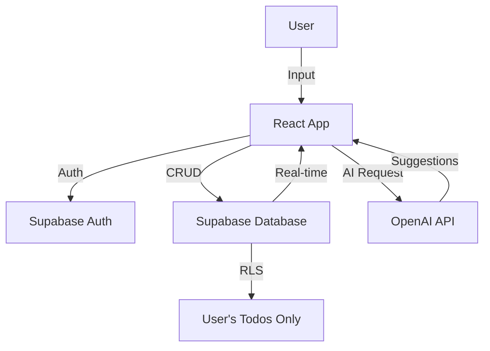

### Vision
A modern, intelligent todo application that revolutionizes task management by combining AI-powered features with a clean, intuitive interface. Users can manage tasks effortlessly using natural language, get smart suggestions, and stay organized across all devices.

### Target Audience
- Busy professionals who need efficient task management
- Students managing multiple projects and deadlines
- Teams looking for simple collaboration tools
- Anyone who wants to be more productive with AI assistance

### The Problem
Current todo apps are either too simple (just lists) or too complex (overwhelming features). Users waste time manually categorizing tasks, setting priorities, and remembering what to do next. Natural language input is rarely supported, making task entry tedious.

### The Solution
An AI-powered todo app that understands natural language ("remind me to call mom tomorrow at 3pm"), automatically categorizes and prioritizes tasks, provides smart suggestions based on patterns, and syncs seamlessly across devices. Simple enough for quick task entry, smart enough to be truly helpful.

---

## 2. Tech Stack

### Frontend
- React 18
- TypeScript
- TailwindCSS
- React Router
- React Query

### Backend
- Supabase (PostgreSQL)
- Supabase Auth
- Supabase Real-time
- Supabase Edge Functions

### Database
- PostgreSQL (via Supabase)
- Row Level Security

### Infrastructure
- Vercel (hosting)
- GitHub (version control)
- GitHub Actions (CI/CD)

### AI Components
- OpenAI GPT-4 API
- Natural Language Processing
- Task categorization model
- Priority recommendation system

---

## 3. Architecture

### Authentication
Supabase Auth with email/password and social logins (Google, GitHub). JWT-based authentication with automatic token refresh. Row Level Security ensures users only see their own todos.

### Data Flow
```
User Input → React App → Supabase Client → PostgreSQL Database
                ↓
         OpenAI API (for AI features)
                ↓
         Smart Suggestions → React App → User
```

Real-time subscriptions for instant updates across devices.

### Diagram (Mermaid)


---

## 4. Database Schema

```sql
-- Todos table
CREATE TABLE todos (
  id UUID PRIMARY KEY DEFAULT uuid_generate_v4(),
  user_id UUID REFERENCES auth.users NOT NULL,
  title TEXT NOT NULL,
  description TEXT,
  completed BOOLEAN DEFAULT FALSE,
  priority TEXT CHECK (priority IN ('low', 'medium', 'high')),
  category TEXT,
  due_date TIMESTAMP WITH TIME ZONE,
  created_at TIMESTAMP WITH TIME ZONE DEFAULT NOW(),
  updated_at TIMESTAMP WITH TIME ZONE DEFAULT NOW()
);

-- Enable Row Level Security
ALTER TABLE todos ENABLE ROW LEVEL SECURITY;

-- Policies
CREATE POLICY "Users can view own todos" ON todos
  FOR SELECT USING (auth.uid() = user_id);

CREATE POLICY "Users can insert own todos" ON todos
  FOR INSERT WITH CHECK (auth.uid() = user_id);

CREATE POLICY "Users can update own todos" ON todos
  FOR UPDATE USING (auth.uid() = user_id);

CREATE POLICY "Users can delete own todos" ON todos
  FOR DELETE USING (auth.uid() = user_id);

-- Indexes
CREATE INDEX idx_todos_user_id ON todos(user_id);
CREATE INDEX idx_todos_due_date ON todos(due_date);
CREATE INDEX idx_todos_completed ON todos(completed);
```

---

## 5. Roadmap

### Phase 1: MVP (Week 1 - Dec 1-7)
- [ ] Setup project (React + TypeScript + TailwindCSS)
- [ ] Setup Supabase project and database
- [ ] Implement authentication (email/password)
- [ ] Build basic CRUD for todos
- [ ] Create responsive UI
- [ ] Deploy to Vercel

### Phase 2: AI Features (Week 2 - Dec 8-14)
- [ ] Integrate OpenAI API
- [ ] Natural language input parsing
- [ ] AI-powered task suggestions
- [ ] Smart categorization
- [ ] Priority recommendations
- [ ] Due date suggestions

### Phase 3: Advanced Features (Week 3 - Dec 15-21)
- [ ] Real-time sync across devices
- [ ] Recurring tasks
- [ ] Subtasks
- [ ] Tags and labels
- [ ] Search functionality
- [ ] Keyboard shortcuts

### Phase 4: Polish & Launch (Week 4 - Dec 22-28)
- [ ] Dark mode
- [ ] Animations and transitions
- [ ] Performance optimization
- [ ] Bug fixes
- [ ] User testing
- [ ] Public launch

---

## 6. Business Rules

- Users must be authenticated to create/view todos
- Each user can only access their own todos (enforced by RLS)
- Todo titles are required, descriptions are optional
- Priority can only be: low, medium, or high
- Due dates must be in the future (validation)
- Completed todos are not deleted, just marked as complete
- AI features require valid OpenAI API key
- Free tier: 100 todos per user
- Pro tier: Unlimited todos + advanced AI features
- Data is backed up daily
- User data is never shared with third parties
- GDPR compliant - users can export/delete their data
