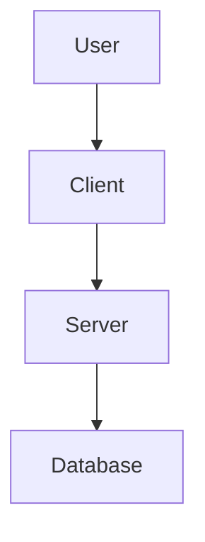

# taskflow - Blueprint

> **Version**: 0.1.0
> **Created**: 2025-11-30T09:50:40.763Z
> **Author**: User

---

## 1. The Spark (Ý Tưởng Cốt Lõi)

### Vision
Optimize Startup management with SBBL methodology

### Target Audience
Developer

### The Problem
Help them to build project faster with AI and Optimize time and cost

### The Solution
start up management

---

## 2. Tech Stack

### Frontend
- (Not specified)

### Backend
- (Not specified)

### Database
- (Not specified)

### Infrastructure
- (Not specified)

### AI Components
- (Not specified)

---

## 3. Architecture

### Authentication
Supabase Auth

### Data Flow
(Not specified)

### Diagram (Mermaid)

---

## 4. Database Schema

(Not specified)

---

## 5. Roadmap

### Phase 1 (Week 1)
- [ ] MVP Development

---

## 6. Business Rules

- (No specific business rules defined yet)
